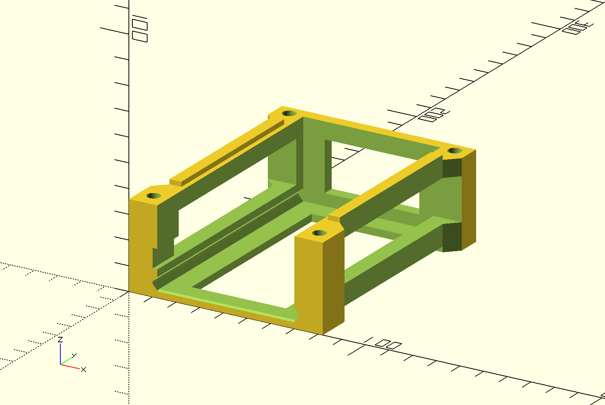

# 2U Rack for RaspberryPi and Arduino
3d print model for a modular 2U rack for RaspberryPi 4, Arduino Mega and OLED display.

## Features
The models are based on the excellent [Thingiverse model](https://www.thingiverse.com/thing:4078710), use [OpenSCAD](https://www.openscad.org/) and have been extended to
* Increase depth to support Arduino Mega 
* Increase height for Arduino Mega frame to support shields
* New tray to support OLED mounting

***show image of full 2U rack***

## How To Use
* Install OpenSCAD, extend models and export STL's, or
* Reuse and print [STL files](stl) without modification

### Models
#### RaspberryPi 4 Tray


#### RaspberryPi 4 Frame



#### Arduino Mega Tray


#### Arduino Frame


#### OLED Tray for Freetronics [FTOLED](https://www.freetronics.com.au/products/128x128-pixel-oled-module#.XzFH5PgzbvU)


### Extension
The [rack-config.scad](openscad/rack-config.scad) defines core variables that configure all models:

```c 
/* Represents M5 radius bolt size */
bolt_size = 2.5;

/* Represents different lengths of devices - max should be chosen
arduino-mega = 101.6
raspberry-pi = 85
*/
device_length = 101.6;

/* If an arduino shield required, reduce number_to_fit to increase height, otherwise chose 12 or 13 if just raspberrypi.
    e.g. 9 for Arduino Mega
*/
arduino_shield = true;
```

## Future Work

Finish this README.
